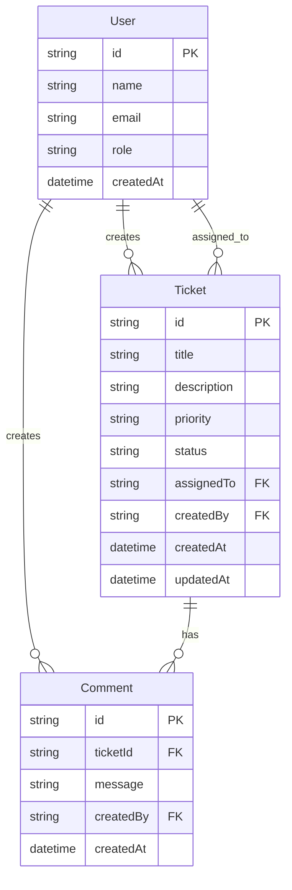

# Data Model

Aligns with [docs/entities.md](./docs/entities.md) and `src/backend/prisma/schema.prisma`.

## ER diagram

## Enums (validated in API)

| Enum | Values |
| --- | --- |
| Priority | `LOW`, `MEDIUM`, `HIGH` |
| Status | `OPEN`, `IN_PROGRESS`, `RESOLVED`, `CLOSED`, `CANCELLED` |
| Role (seed) | `AGENT`, `ADMIN` |

SQLite stores these as strings; Zod enforces allowed values at the API boundary.

## Persistence

| Item | Location |
| --- | --- |
| Schema | `src/backend/prisma/schema.prisma` |
| Migrations | `src/backend/prisma/migrations/` |
| Seed | `src/backend/prisma/seed.js` |
| Dev DB file | `src/backend/database/dev.db` (gitignored) |
| Setup notes | [database/setup-notes.md](./database/setup-notes.md) |

## Seed snapshot

- 4 users (upsert by email)
- 3 sample tickets in varied statuses (skip if title exists)
- Sample comments on some tickets

## Terminal-ticket rule (data behavior)

When `status` is `CLOSED` or `CANCELLED`, field updates are rejected; comments may still be inserted.
