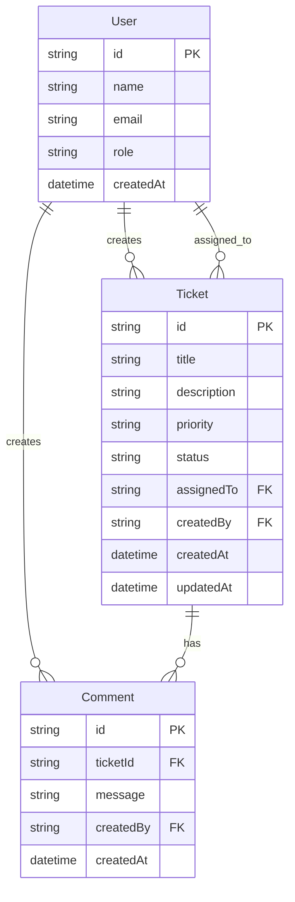

# Entities

**Project:** Support Ticket Management System (Core)  
**Source:** [JS - AI_Assesment_Project.md](./JS%20-%20AI_Assesment_Project.md)

---

## Entity relationship diagram

---

## User

Seeded only in Core — no user-management UI.

| Field | Type | Required | Notes |
| --- | --- | --- | --- |
| `id` | string (PK) | Yes | Unique identifier (e.g. CUID/UUID) |
| `name` | string | Yes | Display name |
| `email` | string | Yes | Unique |
| `role` | string | Yes | e.g. `AGENT`, `ADMIN` — display-only in Core |
| `createdAt` | datetime | Yes | Auto-set on creation |

**Relationships:**
- Creates many `Ticket` records (`createdBy`)
- May be assigned to many `Ticket` records (`assignedTo`)
- Creates many `Comment` records (`createdBy`)

---

## Ticket

| Field | Type | Required | Notes |
| --- | --- | --- | --- |
| `id` | string (PK) | Yes | Unique identifier |
| `title` | string | Yes | Max length TBD (proposed: 200) |
| `description` | string | Yes | Max length TBD (proposed: 5000) |
| `priority` | enum | Yes | See priority enum below |
| `status` | enum | Yes | Defaults to `OPEN`; see status enum below |
| `assignedTo` | string (FK → User) | No | Nullable; unassigned if null |
| `createdBy` | string (FK → User) | Yes | References seeded user |
| `createdAt` | datetime | Yes | Auto-set on creation |
| `updatedAt` | datetime | Yes | Auto-updated on modification |

**Relationships:**
- Belongs to one creator (`User` via `createdBy`)
- Optionally assigned to one user (`User` via `assignedTo`)
- Has many `Comment` records

---

## Comment

| Field | Type | Required | Notes |
| --- | --- | --- | --- |
| `id` | string (PK) | Yes | Unique identifier |
| `ticketId` | string (FK → Ticket) | Yes | Parent ticket |
| `message` | string | Yes | Max length TBD (proposed: 2000) |
| `createdBy` | string (FK → User) | Yes | References seeded user |
| `createdAt` | datetime | Yes | Auto-set on creation |

**Relationships:**
- Belongs to one `Ticket`
- Belongs to one author (`User` via `createdBy`)

---

## Enumerations

### Priority

Not defined in the assessment doc. Proposed values:

| Value | Description |
| --- | --- |
| `LOW` | Low urgency |
| `MEDIUM` | Normal urgency (default) |
| `HIGH` | High urgency |

### Status

| Value | Description | Terminal? |
| --- | --- | --- |
| `OPEN` | Newly created, not yet worked | No |
| `IN_PROGRESS` | Actively being worked | No |
| `RESOLVED` | Fix/work complete, awaiting closure | No |
| `CLOSED` | Fully closed | Yes |
| `CANCELLED` | Cancelled without resolution | Yes |

### Role (seed data)

| Value | Description |
| --- | --- |
| `AGENT` | Support agent |
| `ADMIN` | Administrator |

Roles are display-only in Core (no RBAC enforcement without Stretch auth).

---

## Business rules

| Rule | Description |
| --- | --- |
| BR-01 | New tickets always start in `OPEN` status. |
| BR-02 | Status can only change via the state machine (see [functional-requirements.md](./functional-requirements.md)). |
| BR-03 | `assignedTo` is optional; null means unassigned. |
| BR-04 | `createdBy` must reference an existing seeded user. |
| BR-05 | Comments on terminal tickets (`CLOSED`, `CANCELLED`) are allowed; field edits on terminal tickets are blocked (proposed — see [questions-and-ambiguities.md](./questions-and-ambiguities.md)). |
| BR-06 | Comments are create-and-list only in Core (no edit/delete). |
