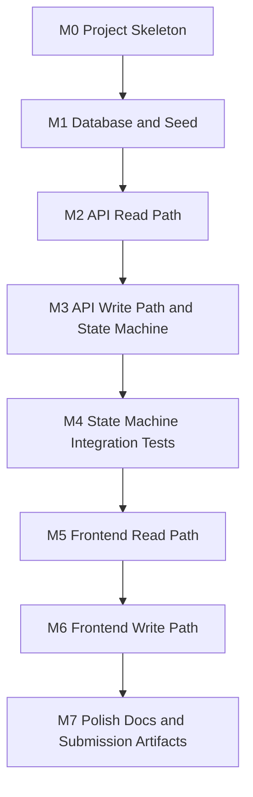

# Implementation Plan

**Project:** Support Ticket Management System (Core)  
**Based on:** [functional-requirements.md](./functional-requirements.md), [non-functional-requirements.md](./non-functional-requirements.md), [entities.md](./entities.md), [api-endpoints.md](./api-endpoints.md), [user-flows.md](./user-flows.md), [questions-and-ambiguities.md](./questions-and-ambiguities.md), [proposed-architecture.md](./proposed-architecture.md)

**Scope:** Core only. Stretch deferred.  
**Stack:** React (Vite) + Node.js/Express + SQLite/Prisma + Jest/Supertest  
**Language:** JavaScript (ES modules)

**Status:** Ready for step-by-step implementation (one milestone per request).

---

## Readiness gate

Planning is complete when all of the following are true:

| Check | Status |
| --- | --- |
| Functional + non-functional requirements documented | Done |
| Entities, API contract, user flows documented | Done |
| Ambiguities resolved with locked defaults | Done — see [questions-and-ambiguities.md](./questions-and-ambiguities.md) |
| Architecture + stack chosen | Done |
| Milestones independently runnable with exit criteria | Done |
| Cursor project rules in `.cursor/rules/project.mdc` | Done |
| Stretch explicitly deferred | Done |

No further product decisions are required before **M0**.

---

## Step-by-step implementation protocol

Use this when asking the agent to build. One milestone per request.

### How to ask

```text
Implement Milestone N only (from docs/implementation-plan.md).
Stop when exit criteria are met.
Do not start Milestone N+1.
Do not add Stretch features.
```

Examples: `Implement Milestone 0 only.` → then verify → `Implement Milestone 1 only.`

### Agent must

1. Implement **only** the named milestone’s deliverables and tasks.
2. Stop when that milestone’s **exit criteria** pass.
3. Summarize what changed, how to verify, and what is next.
4. Avoid unrelated file changes and new libraries unless already approved below.

### Agent must not

- Jump ahead to later milestones
- Add auth, pagination, OpenAPI, Docker, CI, or other Stretch
- Switch to TypeScript unless explicitly requested
- Leave the milestone in a non-runnable state

### Verification before next milestone

After each milestone, run that milestone’s “How to run / verify” commands. Only then request the next one.

### Approved libraries (no need to re-ask)

| Area | Packages |
| --- | --- |
| Backend | `express`, `cors`, `@prisma/client`, `prisma`, `zod` |
| Frontend | `react`, `react-dom`, `react-router-dom`, `vite` |
| Tooling | `concurrently`, `jest`, `supertest`, `eslint` (+ React/Vite ESLint presets as needed) |

Anything else: **ask first**.

### Locked defaults (do not re-litigate during build)

| Topic | Lock |
| --- | --- |
| Acting user | Seeded-user picker + `localStorage` |
| Priority | `LOW` \| `MEDIUM` \| `HIGH` |
| Search | Title + description |
| Assignee on create | Optional |
| Terminal tickets | Comments yes; field edits no |
| Frontend routing | `react-router-dom` (`/`, `/tickets/new`, `/tickets/:id`) |
| Tests location | `src/backend/tests/` (Jest against app factory) |
| DB file | gitignored SQLite under backend database path |

---

## Principles

1. **Each milestone is independently runnable** — after completing it, you can start/verify the system at that stage without unfinished later milestones.
2. **Thin Core first** — working vertical slices over broad unfinished layers.
3. **State machine early** — the signature Core judgment piece is exercised as soon as tickets exist.
4. **Artifacts in parallel** — assessment lifecycle docs and prompt history grow alongside code; do not leave them to the end.
5. **No secrets in the repo** — use `.env.example` only.
6. **Strict sequential order** — implement M0 → M1 → … → M7 in order for step-by-step asks.

---

## Milestone map



| Milestone | Focus | Independently runnable when… |
| --- | --- | --- |
| [M0](#milestone-0--project-skeleton) | Repo + tooling | `npm install` works; health endpoint responds |
| [M1](#milestone-1--database-and-seed) | Schema, migrate, seed | DB file exists; seed users/tickets queryable |
| [M2](#milestone-2--api-read-path) | List/get users & tickets | `curl` list/detail/search/filter works |
| [M3](#milestone-3--api-write-path-and-state-machine) | Create/update/status/comments | Full API Core via HTTP clients |
| [M4](#milestone-4--state-machine-integration-tests) | Mandatory SM tests | `npm test` green for valid/invalid transitions |
| [M5](#milestone-5--frontend-read-path) | List + detail UI | Browser: browse, search, filter, view detail |
| [M6](#milestone-6--frontend-write-path) | Create/edit/status/comments | Browser: full Core user flows end-to-end |
| [M7](#milestone-7--polish-docs-and-submission-artifacts) | README + assessment artifacts | Clone → README → run; submission package complete |

**Estimated effort:** ~8–12 focused hours for Core code; remaining week for lifecycle artifacts (assessment guidance).

---

## Milestone 0 — Project skeleton

### Goal

A runnable monorepo shell: backend server with health check, frontend Vite app that can talk to the API, shared scripts, and env template.

### Deliverables

- Root `package.json` (workspaces: `src/backend`, `src/frontend`)
- `.gitignore`, `.env.example`
- Backend Express app with `GET /api/health`
- Frontend Vite + React app with a simple “API status” page
- Root scripts: `dev`, `dev:backend`, `dev:frontend`
- Stub folders for `database/`, `tests/`, `ai-prompts/`, `tool-specific/cursor-workflow/`

### Tasks

1. Initialize npm workspaces and install base dependencies.
2. Create Express app factory + `index.js` listening on port `3001`.
3. Scaffold Vite React app; proxy `/api` to `http://localhost:3001`.
4. Add concurrent `npm run dev`.
5. Add baseline ESLint for backend and frontend (minimal config; fixable later).
6. Create stub folders: `database/`, `ai-prompts/`, `tool-specific/cursor-workflow/` (empty `.gitkeep` or short README stubs).
7. Document how to start in a short draft `README.md` section.

### How to run / verify (exit criteria)

```bash
npm install
npm run dev
# Backend: GET http://localhost:3001/api/health → { "status": "ok" }
# Frontend: open http://localhost:5173 → shows API reachable
```

**Done when:** Health check returns `ok` and the frontend loads without errors.

### Depends on

Nothing (first milestone).

### Out of scope

Database, domain routes, ticket UI features, React Router pages (add routes in M5).

---

## Milestone 1 — Database and seed

### Goal

Persistent User / Ticket / Comment schema with migrations and seed data. No domain API yet required beyond optional smoke queries via Prisma CLI or a one-off script.

### Deliverables

- Prisma schema matching [entities.md](./entities.md)
- Initial migration SQL under `src/backend/prisma/migrations/`
- Seed script (3–4 users, 2–3 tickets in varied statuses)
- `database/setup-notes.md` (or symlink/copy notes)
- Scripts: `db:generate`, `db:migrate`, `db:seed`, `db:setup`
- `.env` with `DATABASE_URL=file:./database/dev.db` (local only; not committed)

### Tasks

1. Define Prisma models: User, Ticket, Comment + FKs.
2. Create and apply migration.
3. Implement idempotent-enough seed (upsert users; skip existing sample tickets by title).
4. Document setup steps in `database/setup-notes.md`.
5. Confirm `.db` is gitignored.

### How to run / verify (exit criteria)

```bash
cp .env.example .env
npm run db:setup
# Inspect via Prisma Studio or sqlite3: users and tickets present
npm run dev
# Health still works after DB setup
```

**Done when:** Restarting the process leaves seed data intact; schema matches entities doc.

### Depends on

M0.

### Out of scope

Ticket/user REST endpoints (next milestone).

---

## Milestone 2 — API read path

### Goal

Read-only Core API: list users, list tickets (search + status filter), get ticket detail with comments and `allowedTransitions`. Independently usable via HTTP clients.

### Deliverables

- Shared error helper (`error.code`, `message`, `details?`)
- State machine pure module (read helpers: `getAllowedTransitions`) — even if writes come in M3
- Endpoints from [api-endpoints.md](./api-endpoints.md):
  - `GET /api/users`
  - `GET /api/tickets?q=&status=`
  - `GET /api/tickets/:id`
- Zod validation for list query params

### Tasks

1. Implement Prisma queries with creator/assignee includes.
2. Keyword search on title + description; filter by status.
3. Include comments ordered ascending on detail.
4. Attach `allowedTransitions` on detail responses.
5. Manual verification with `curl` / Bruno / Postman examples (document in notes).
6. **Gotcha:** Prisma `contains` on SQLite is case-sensitive by default — normalize (e.g. store/search lowercased fields, or use a raw `LIKE` with lowercasing) so keyword search feels case-insensitive.

### How to run / verify (exit criteria)

```bash
npm run db:setup
npm run dev:backend
curl http://localhost:3001/api/users
curl "http://localhost:3001/api/tickets?status=OPEN"
curl "http://localhost:3001/api/tickets?q=password"
curl http://localhost:3001/api/tickets/<id>
```

**Done when:** Seeded data is returned correctly; unknown ID → `404 TICKET_NOT_FOUND`; invalid `status` query → `400`; search finds seed tickets regardless of keyword casing.

### Depends on

M1 (complete). Do not start M2 until M1 exit criteria pass.

### Out of scope

Create/update/status/comments mutations.

---

## Milestone 3 — API write path and state machine

### Goal

Full Core backend: create ticket, update fields, enforce status transitions, add comments. Backend alone is feature-complete for Core (minus UI and formal tests).

### Deliverables

- Endpoints:
  - `POST /api/tickets`
  - `PATCH /api/tickets/:id`
  - `POST /api/tickets/:id/status`
  - `POST /api/tickets/:id/comments`
- Zod schemas for all write bodies
- State machine enforcement (`canTransition`); reject with `INVALID_TRANSITION`
- Terminal status rule: block field updates (`TICKET_TERMINAL`); allow comments
- Separate status endpoint (PATCH must not accept `status`)

### Tasks

1. Wire create with default `OPEN`; validate users exist.
2. Wire patch (title, description, priority, assignedTo).
3. Wire status transitions using shared SM module.
4. Wire comment create.
5. Manual matrix check of all valid and a few invalid transitions via `curl`.

### How to run / verify (exit criteria)

```bash
npm run db:setup && npm run dev:backend
# Create → list → get → patch → valid status → invalid status (expect 400)
# Add comment → get shows comment
# Restart server → data still present
```

**Done when:** All Core API acceptance criteria for backend are met via HTTP.

### Depends on

M2.

### Out of scope

Automated tests (M4); frontend (M5–M6).

---

## Milestone 4 — State machine integration tests

### Goal

Mandatory Core test tier: integration tests proving every valid transition succeeds and invalid ones are rejected. Independently runnable with `npm test` (no UI required).

### Deliverables

- Jest + Supertest setup against app factory
- Test files under `src/backend/tests/` (e.g. `stateMachine.integration.test.js`)
- Isolated test database (separate SQLite file via test `DATABASE_URL`; never reuse `dev.db`)
- Test suite covering:
  - All valid edges: `OPEN→IN_PROGRESS`, `OPEN→CANCELLED`, `IN_PROGRESS→RESOLVED`, `IN_PROGRESS→CANCELLED`, `RESOLVED→CLOSED`
  - Invalid edges: e.g. `OPEN→CLOSED`, `OPEN→RESOLVED`, `CLOSED→OPEN`, `CANCELLED→IN_PROGRESS`, `RESOLVED→OPEN`
- Optional: validation and not-found smoke cases (nice-to-have, not Stretch unit tiers)

### Tasks

1. Configure Jest for ESM / project conventions.
2. Reset or migrate test DB in `beforeAll` / `beforeEach`.
3. Seed minimal users for create/transition fixtures.
4. Assert status codes and `error.code === 'INVALID_TRANSITION'`.
5. Document how to run tests in README / draft `test-strategy.md`.

### How to run / verify (exit criteria)

```bash
npm run test
# All SM integration tests pass without starting the UI
```

**Done when:** Assessment criterion “state-machine integration tests pass” is satisfied.

### Depends on

M3.

### Out of scope

Frontend; full unit/component test tiers (Stretch).

---

## Milestone 5 — Frontend read path

### Goal

Browsable UI for list, search, filter, and detail (including comments). Independently useful for demos of read flows without create/edit yet.

### Deliverables

- `react-router-dom` routes: `/` (list), `/tickets/:id` (detail)
- Acting-user picker (seeded users; `localStorage`)
- Ticket list page with keyword search and status filter
- Ticket detail page: fields, assignee/creator, comments, status badge
- Loading, empty, and error states for read failures
- Client API helpers for GET endpoints

### Tasks

1. Add React Router; list and detail routes only (`/tickets/new` can wait for M6).
2. Fetch users and tickets on load.
3. Wire search/filter controls to `GET /api/tickets`.
4. Route to detail; render comments chronologically.
5. Show `allowedTransitions` as read-only hints (actions in M6).
6. Map `TICKET_NOT_FOUND` to a not-found view.

### How to run / verify (exit criteria)

```bash
npm run db:setup
npm run test          # must still pass from M4
npm run dev
# Browser: list seeded tickets; search; filter; open detail; see comments
```

**Done when:** Flows 1 and 3 from [user-flows.md](./user-flows.md) work without write actions; M4 tests still green.

### Depends on

**M4 complete** (backend API + SM tests frozen before UI). Sequential gate: do not start M5 until M4 exit criteria pass.

### Out of scope

Create, edit, status buttons, comment form.

---

## Milestone 6 — Frontend write path

### Goal

Complete Core UI: create, update, status change, add comments, with meaningful error states — full end-to-end Core acceptance criteria in the browser.

### Deliverables

- Create ticket form (title, description, priority, createdBy, optional assignee)
- Edit fields on detail (blocked UI when terminal)
- Status actions limited to `allowedTransitions`; show `INVALID_TRANSITION` clearly if API rejects
- Add comment form with acting user
- Error banners / inline validation for `VALIDATION_ERROR`, `TICKET_TERMINAL`, etc.

### Tasks

1. Implement create → redirect to list or detail.
2. Implement patch save with success/error feedback.
3. Implement status transition buttons calling `POST .../status`.
4. Implement comment submit and refresh list.
5. Walk through all Core acceptance criteria manually (checklist).

### How to run / verify (exit criteria)

```bash
npm run db:setup
npm run test          # still green
npm run dev
# Manual: create → edit → valid status → invalid status (if forced) → comment
# Restart → data persists
```

**Done when:** All Core acceptance criteria in [functional-requirements.md](./functional-requirements.md) pass via UI + API; tests still pass.

### Depends on

**M5 complete.** Sequential gate: do not start M6 until M5 exit criteria pass. (M3–M4 already required via the chain.)

### Out of scope

Auth, pagination, Stretch filters, Docker/CI.

---

## Milestone 7 — Polish, docs, and submission artifacts

### Goal

Submission-ready repository: anyone can clone and run from README; assessment lifecycle artifacts and Cursor tool-specific folder are complete. Independently “runnable” as a documented product handoff (not a new runtime feature).

### Deliverables

**Operability**
- Complete `README.md` (prerequisites, install, db setup, run, test, ports)
- `.env.example` accurate
- `database/setup-notes.md` finalized
- Confirm no secrets committed

**Assessment artifacts** (per guide; fill from analysis docs + real work)

| Artifact | Notes |
| --- | --- |
| `candidate-info.md` | Identity, stack, tool, dates |
| `tool-workflow.md` | Part A |
| `requirements-analysis.md` | Can summarize/link `docs/*` |
| `acceptance-criteria.md` | Checklist |
| `implementation-plan.md` | Can point to / adapt this doc |
| `design-notes.md` | Architecture decisions |
| `api-contract.md` | Align with `docs/api-endpoints.md` |
| `data-model.md` | Align with `docs/entities.md` |
| `ui-flow.md` | Align with `docs/user-flows.md` |
| `test-strategy.md` / `test-results.md` | SM integration focus |
| `debugging-notes.md`, `code-review-notes.md`, `review-fixes.md` | Fill during/after build |
| `pr-description.md`, `reflection.md`, `final-ai-usage-summary.md` | End of exercise |
| `ai-prompts/*.md` | Grouped prompt history |
| `tool-specific/cursor-workflow/*` | project-context, spec, tasks, acceptance-criteria, rules |

### Tasks

1. Finalize README with copy-paste commands.
2. Cross-check Core acceptance criteria checkbox list.
3. Capture prompt history and reflection honestly.
4. Smoke test from a clean clone mindset (delete `node_modules` / `.db`, re-run setup).
5. Optional: light UI polish only if it does not delay artifacts.

### How to run / verify (exit criteria)

```bash
# Clean verification
rm -rf node_modules src/backend/node_modules src/frontend/node_modules
# remove local .db if present
npm install && cp .env.example .env && npm run db:setup && npm run test && npm run dev
```

**Done when:** Clean setup works; Core demo + tests pass; required markdown artifacts exist and are non-empty; Stretch explicitly listed as future work.

### Depends on

M6 (feature-complete Core). Prompt/history notes should have been started from M0 onward.

---

## Cross-cutting work (every milestone)

| Activity | When |
| --- | --- |
| Append to `ai-prompts/` for planning/design/impl/test/debug/review | Ongoing |
| Note debugging incidents | As they happen |
| Avoid committing `.env` or `*.db` | Always |
| Prefer smallest change that meets the milestone exit criteria | Always |

---

## Risk register

| Risk | Milestone | Mitigation |
| --- | --- | --- |
| Scope creep into Stretch | M3–M6 | Park Stretch in “future improvements”; protect artifact time |
| State machine buried in controllers | M3–M4 | Keep pure `stateMachine` module; tests import same rules |
| Frontend blocked on incomplete API | M5 | Complete M2–M3 first; UI consumes frozen contract |
| Flaky tests sharing dev DB | M4 | Separate `DATABASE_URL` for tests |
| Artifact rush at the end | M7 | Draft requirements/design from existing `docs/` early (M0–M1) |

---

## Definition of Done (project)

Core is done when:

1. All FR-01–FR-18 and Core acceptance criteria are met.
2. State-machine integration tests pass.
3. Data survives restart; README enables local setup.
4. No secrets in the repo.
5. Assessment artifacts and prompt history are present and reviewable.
6. Stretch remains optional and documented as out of scope for v1.

---

## Suggested sequencing for a one-week effort

| Day focus | Milestones |
| --- | --- |
| Day 1 | M0 + M1 + start requirements/design artifacts |
| Day 2 | M2 + M3 |
| Day 3 | M4 + start M5 |
| Day 4 | M5 + M6 |
| Day 5 | M6 polish + M7 artifacts, reflection, PR description |

Adjust freely; the assessment allows any order. Prefer finishing M4 before heavy UI so the SM is proven.

---

## Explicitly deferred (Stretch)

Do not pull into Core milestones unless Core + artifacts are done:

- Auth / RBAC / protected routes
- User CRUD
- Priority/assignee filters, sorting, pagination
- OpenAPI, Docker, CI
- Extra unit/component/edge-case test tiers beyond SM integration
