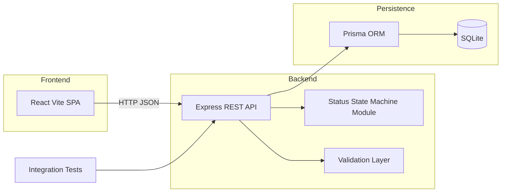

# Proposed Architecture

**Project:** Support Ticket Management System (Core)  
**Source:** [JS - AI_Assesment_Project.md](./JS%20-%20AI_Assesment_Project.md)

---

## System overview



---

## Technology stack

| Layer | Choice | Rationale |
| --- | --- | --- |
| Frontend | React + Vite | Fast dev server; matches JS competency stack |
| Backend | Node.js + Express | Simple REST API; familiar pairing with React |
| ORM | Prisma | Schema-as-code, migrations, seed scripts |
| Database | SQLite | Zero external services; file-based persistence |
| Validation | Zod (backend) | Schema validation with clear error messages |
| Testing | Jest + Supertest | HTTP integration tests against the API |

---

## Repository layout

Aligned with the assessment guide's required structure:

```
ai-practical-assessment/
  README.md
  candidate-info.md
  tool-workflow.md
  requirements-analysis.md
  acceptance-criteria.md
  implementation-plan.md
  design-notes.md
  api-contract.md
  data-model.md
  ui-flow.md
  test-strategy.md
  src/
    frontend/          # React Vite SPA
    backend/           # Express REST API
  database/
    schema-or-migrations/
    seed-data/
    setup-notes.md
  tests/               # Integration tests (state machine focus)
  ai-prompts/
    planning.md
    design.md
    implementation.md
    testing.md
    debugging.md
    code-review.md
    documentation.md
  tool-specific/
    cursor-workflow/   # If using Cursor
  docs/                # Analysis documents (this folder)
```

---

## Backend architecture

### Layers

```
Request → Router → Validation (Zod) → Controller → Service/StateMachine → Prisma → SQLite
```

### Key modules

| Module | Responsibility |
| --- | --- |
| `stateMachine.js` | Pure function: `canTransition(from, to)`, `getAllowedTransitions(status)` |
| `validation.js` | Zod schemas for create/update/comment/status payloads |
| `routes/tickets.js` | Route handlers for all ticket and comment endpoints |
| `routes/users.js` | Route handler for listing seeded users |
| `app.js` | Express app factory (used by server and tests) |
| `db.js` | Prisma client singleton |

### State machine module

Central to Core — the "signature judgment piece":

```javascript
const ALLOWED_TRANSITIONS = {
  OPEN:         ['IN_PROGRESS', 'CANCELLED'],
  IN_PROGRESS:  ['RESOLVED', 'CANCELLED'],
  RESOLVED:     ['CLOSED'],
  CLOSED:       [],
  CANCELLED:    [],
};
```

- Pure module with no DB dependency.
- Imported by route handlers and integration tests.
- Same logic used at runtime and in tests — no drift.

### Design decisions

| Decision | Reason |
| --- | --- |
| Separate `POST /status` endpoint | `PATCH` cannot set status; SM cannot be bypassed |
| `GET /users` for pickers | No auth in Core; UI needs user list |
| `allowedTransitions` in detail response | Frontend renders only valid actions |
| Terminal status blocks field edits | Business rule; comments still allowed |
| App factory pattern | Same app instance used by server and test runner |

---

## Frontend architecture

### Pages / views

Routing: **`react-router-dom`** (approved for Core).

| View | Route | API calls | Milestone |
| --- | --- | --- | --- |
| Ticket list | `/` | `GET /api/tickets`, `GET /api/users` | M5 |
| Ticket detail | `/tickets/:id` | `GET /api/tickets/:id` (+ writes in M6) | M5 / M6 |
| Create ticket | `/tickets/new` | `POST /api/tickets` | M6 |

### State management

- Local component state + `fetch` (no Redux/Zustand — do not add unless asked).
- Acting user stored in `localStorage`.
- Search/filter via local state or URL query params; debounce keyword input before calling the API.

### Error handling

Map API `error.code` to UI messages:

| Code | UI behavior |
| --- | --- |
| `VALIDATION_ERROR` | Inline field errors or form summary |
| `INVALID_TRANSITION` | Banner with allowed transitions |
| `TICKET_TERMINAL` | Message that ticket cannot be edited |
| `TICKET_NOT_FOUND` | Not-found page |
| `USER_NOT_FOUND` | Error on user picker |
| `INTERNAL_ERROR` | Generic error banner with retry |

---

## Database

### Schema

See [entities.md](./entities.md) for full field definitions.

Three tables: `User`, `Ticket`, `Comment`.

### Migrations

Prisma migration files in `src/backend/prisma/migrations/`.

### Seed data

- 3–4 users (mix of `AGENT` and `ADMIN` roles).
- 2–3 sample tickets in various statuses.
- Seed script: `src/backend/prisma/seed.js`.

### Setup

```bash
cp .env.example .env
npm run db:setup    # migrate + seed
```

---

## Testing strategy

### Mandatory (Core)

Integration tests for the state machine via HTTP:

| Test case | Expected |
| --- | --- |
| `OPEN → IN_PROGRESS` | `200` |
| `OPEN → CANCELLED` | `200` |
| `IN_PROGRESS → RESOLVED` | `200` |
| `IN_PROGRESS → CANCELLED` | `200` |
| `RESOLVED → CLOSED` | `200` |
| `OPEN → CLOSED` | `400 INVALID_TRANSITION` |
| `OPEN → RESOLVED` | `400 INVALID_TRANSITION` |
| `CLOSED → OPEN` | `400 INVALID_TRANSITION` |
| `CANCELLED → IN_PROGRESS` | `400 INVALID_TRANSITION` |

Tests live under `src/backend/tests/` and run against a **separate** SQLite test database (never `dev.db`).

### Optional (Stretch)

- Unit tests for `stateMachine.js` pure functions.
- Component tests for React forms.
- Edge-case tests (empty strings, non-existent IDs).

---

## Development workflow

```bash
# Install
npm install

# Database
cp .env.example .env
npm run db:setup

# Run (frontend + backend concurrently)
npm run dev

# Test
npm run test
```

| Service | Port |
| --- | --- |
| Backend API | `3001` |
| Frontend dev server | `5173` |

Frontend proxies `/api` to backend via Vite config.

---

## Delivery emphasis

Per the assessment guide:

- **Working Core + visible AI lifecycle artifacts** matter more than Stretch features.
- Keep the application thin; invest time in prompts, test notes, review, and reflection.
- A clean, well-documented Core alone is a strong result.
