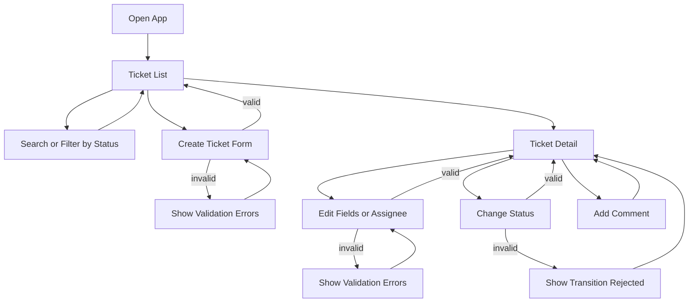

# User Flows

**Project:** Support Ticket Management System (Core)  
**Source:** [JS - AI_Assesment_Project.md](./JS%20-%20AI_Assesment_Project.md)

---

## Flow overview

---

## Flow 1: Browse and search tickets

**Actor:** Internal support user (selected via user picker)

**Steps:**
1. User opens the application.
2. Ticket list loads from `GET /api/tickets`.
3. User optionally enters a keyword → triggers search (`?q=keyword`).
4. User optionally selects a status filter → triggers filter (`?status=OPEN`).
5. List updates to show matching tickets.

**Success:** Filtered/searched results display with title, priority, status, assignee, and dates.

**Errors:**
- API unreachable → show connection error with retry option.
- Empty results → show "no tickets found" message.

---

## Flow 2: Create a ticket

**Actor:** Internal support user

**Steps:**
1. User clicks "Create ticket" from the list view.
2. User fills in title, description, priority.
3. User selects acting user (`createdBy`) from seeded users dropdown.
4. User optionally selects an assignee.
5. User submits the form → `POST /api/tickets`.
6. On success, user is redirected to the list (or detail) and the new ticket appears.

**Success:** Ticket created with status `OPEN`.

**Errors:**
- Missing required fields → inline validation messages before submit.
- Backend validation failure (`400`) → display field-level or summary error.
- User not found (`404`) → display error about invalid user selection.

---

## Flow 3: View ticket detail

**Actor:** Internal support user

**Steps:**
1. User clicks a ticket from the list.
2. App loads `GET /api/tickets/:id`.
3. Detail view shows: title, description, priority, status, creator, assignee, timestamps.
4. Comments section shows all comments in chronological order.
5. Status action buttons show only `allowedTransitions` from the API.

**Success:** Full ticket context is visible.

**Errors:**
- Ticket not found (`404`) → show not-found page with link back to list.

---

## Flow 4: Update ticket fields

**Actor:** Internal support user

**Precondition:** Ticket is not in a terminal status (`CLOSED` or `CANCELLED`).

**Steps:**
1. User opens ticket detail.
2. User edits title, description, priority, or assignee.
3. User saves → `PATCH /api/tickets/:id`.
4. Detail view refreshes with updated data and new `updatedAt`.

**Success:** Fields updated; `updatedAt` reflects the change.

**Errors:**
- Terminal ticket → `400 TICKET_TERMINAL` → show message that the ticket cannot be edited.
- Validation failure → show field errors.
- Assignee not found → show error.

---

## Flow 5: Change ticket status

**Actor:** Internal support user

**Steps:**
1. User opens ticket detail.
2. UI renders buttons/dropdown for statuses in `allowedTransitions` only.
3. User selects a valid next status → `POST /api/tickets/:id/status`.
4. Detail view refreshes with new status and updated allowed transitions.

**Success:** Status advances along a valid path.

**Errors:**
- Invalid transition (`400 INVALID_TRANSITION`) → show message with current status and allowed options.
- Example: attempting `OPEN → CLOSED` shows: "Cannot transition from OPEN to CLOSED. Allowed: In Progress, Cancelled."

**Valid transition examples:**

| Current | User selects | Result |
| --- | --- | --- |
| `OPEN` | `IN_PROGRESS` | Success |
| `OPEN` | `CANCELLED` | Success |
| `IN_PROGRESS` | `RESOLVED` | Success |
| `RESOLVED` | `CLOSED` | Success |
| `OPEN` | `CLOSED` | Rejected |
| `CLOSED` | `OPEN` | Rejected |

---

## Flow 6: Add a comment

**Actor:** Internal support user

**Steps:**
1. User opens ticket detail.
2. User selects acting user (`createdBy`) if not already set in session/picker.
3. User types a comment message.
4. User submits → `POST /api/tickets/:id/comments`.
5. Comment appears at the bottom of the comments list.

**Success:** Comment visible with author name and timestamp.

**Note:** Comments are allowed even on terminal tickets (`CLOSED`, `CANCELLED`).

**Errors:**
- Empty message → inline validation.
- Backend validation failure → show error banner.

---

## Acting user selection (no auth)

Since Core has no authentication, the UI needs a mechanism for `createdBy`:

**Proposed approach:** A persistent user picker (dropdown) in the app header or form context. Selected user is stored in `localStorage` and used as `createdBy` for ticket creation and comments.

This avoids requiring login while still attributing actions to seeded users.
