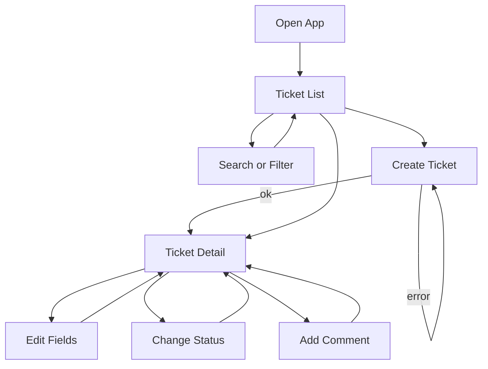

# UI Flow

Aligns with [docs/user-flows.md](./docs/user-flows.md). Implemented routes: `/`, `/tickets/new`, `/tickets/:id`.

## Overview

## Flow 1 — Browse and search

1. Open http://localhost:5173  
2. List loads from `GET /api/tickets`  
3. Enter keyword → `?q=`  
4. Select status → `?status=`  
5. Empty / loading / error+retry states shown as needed  

## Flow 2 — Create ticket

1. **Create ticket** → `/tickets/new`  
2. Fill title, description, priority; creator from acting user (or form); optional assignee  
3. Submit → `POST /api/tickets` → redirect to detail  
4. Validation / `USER_NOT_FOUND` shown as error banner  

## Flow 3 — View detail

1. Click a ticket → `/tickets/:id`  
2. Shows fields, creator/assignee, status badge, comments (oldest first)  
3. Unknown id → not-found view  

## Flow 4 — Edit fields

1. On detail, change title/description/priority/assignee → `PATCH`  
2. If terminal (`CLOSED`/`CANCELLED`), controls disabled; API would return `TICKET_TERMINAL`  

## Flow 5 — Status change

1. Buttons limited to `allowedTransitions`  
2. `POST /api/tickets/:id/status`  
3. On `INVALID_TRANSITION`, show clear error (UI normally prevents illegal clicks)  

## Flow 6 — Comment

1. Enter message with acting user as `createdBy`  
2. `POST .../comments` → refresh comments  
3. Allowed on terminal tickets  

## Acting user

Header picker loads seeded users; selection persists in `localStorage` and drives create/comment `createdBy`.
